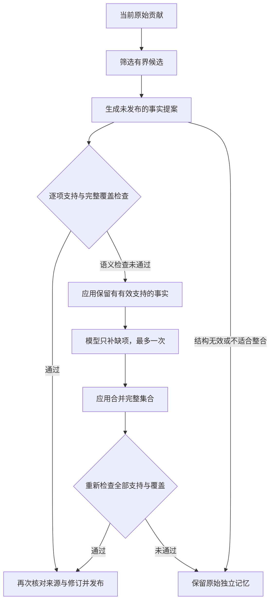

# ADR-0032：保留逐项来源的无损记忆整合

> Superseded for the current memory runtime by [ADR-0033](0033-source-preserving-memory-units.md). This document preserves historical rationale.

- 状态：已接受；2026-09-09 真实服务质量验收不通过，自动无损发布存在待解决阻断。替代 ADR-0031 的整条等价与固定正文限制。
- 日期：2026-09-08。
- 授权：用户明确选择“允许无损整合重叠内容”，要求保留双方细节及逐项来源。
- 动机：用户要求优化真实整理效果；[实测](../exec-plans/reports/organization-real-model-validation-20260908.md)显示整条完全等价规则无法消除概述与详细说明之间的重叠，且单次模型关系判断存在丢失细节的风险。
- 执行计划：[记忆整理质量优化](../exec-plans/active/organization-quality-improvement.md)。

## 当前限制

ADR-0031 将每一条来源贡献视为完整命题。它只允许等价贡献附加到稳定的正式正文；每个来源独立支持整条正文。这一规则便于来源失效后保留其他完整支持，但无法表达“共同事实来自甲乙，补充细节只来自乙”。

因此不能简单允许包含关系触发旧合并函数，也不能拼接正文后继续把所有来源标为完整支持。只降低相似度门槛会增加判断机会，不会改变该表示限制。

## 提议的行为

整理单位改为同一具体对象、同一适用范围和同一问题下的一组事实。允许把等价、包含以及相容的部分重叠整合；仅主题相近、一般规则与具体实例、版本或时间不同、矛盾或范围不明仍保持独立。

正式记忆保留一个稳定 ID，正文由有序事实构成。每项事实记录支持它的当前来源贡献及精确版本，来源只支持自己实际覆盖的事实。共同事实表达一次；独有步骤、条件、例外、限制与否定必须保留。不得通过增加无关事实形成大段主题摘要。

例如，甲说明“模型和数据需要显式移到设备”，乙包含相同操作并补充“检查实际设备”。整合后保留这两项事实；前者可以由甲乙支持，后者只能由乙支持。模型无需把两条原文误判为完整等价才能减少重复。

## 生成与验证

1. 继续按变化贡献查找有界候选，向量门槛从 0.75 扩到 0.70，以覆盖已复现的 0.746789 等价译文。原 325 条的无向候选对从 31 对扩大到 91 对，仍只保留前 8 个候选；门槛不是语义正确性保证。
2. 一次筛选请求标出具有实际重叠的目标，最多尝试其中 2 个。为选定目标读取完整当前贡献，生成未发布的逐项事实提案，每项引用请求内的贡献编号。来源成员最多 32 条，事实最多 32 项，单次输入最多 64 KiB。
3. 应用验证完整返回集合、引用范围、体积上限、元数据兼容性及精确来源资格。时间范围、重要性与置信度必须匹配；标签和实体取并集，不补造值。
4. 事实提案只接收当前贡献正文；笔记标题和路径仅作为对象／项目范围提示，不发送整段笔记背景，也不允许从范围提示扩写事实。标题来自当前 File ID 与内容哈希匹配的索引，过期标题不参与。
5. 将复核拆为独立的单向蕴含检查：每个“来源贡献 → 事实”检查该来源是否独立支持整项事实；每个“完整新事实集合 → 原始贡献”检查原有细节是否全部覆盖。模型不能借用其他检查的证据。移除未通过的来源引用，但每项事实和每个贡献仍须有有效支持，且至少一项事实在新旧成员之间共享。任一覆盖检查失败时不能发布。
6. 对结构正确但支持／覆盖未通过的提案，最多根据具体失败项补充一次。应用保留已有有效支持的事实原文，仅留下通过检查的引用；模型只返回缺失事实，不能重写或删除已保留事实。应用合并精确重复项并限制完整集合的大小，再重新完成全部支持与覆盖校验；仍未通过保留原记忆。输出无效或不适合整合的候选不进入付费修补循环。
7. 发布前再次验证全部来源哈希、贡献语义哈希和正式修订，通过 Vault Core 和可恢复操作原子提交。

共同事实只能取各来源独立支持的较弱命题；不能把“使用／访问”加强成“写入／修改／删除”。某来源明确提供的更具体操作单独保留，不能因为另一来源谈到同一资源就将两者均归为整项支持。

默认行为本身也是事实。“普通请求默认走 R”不能改成“普通请求在 R 模式下走 R”；后者增加条件，未保留默认选择。共同条件行为和单侧默认规则分别保存，不能用 normal／默认 等词的表面出现代替命题覆盖。有序调用链也不能只保留无序节点。提案与逐项复核均应用这些方向约束；真实错误样例须独立复验，提示词本身不构成质量保证。

保持增量调度。每个工作切片最多一次未缓存的逻辑请求，筛选、提案和校验分别保存结果，成功阶段优先续完；取出任务时先清除续跑优先级，失败或崩溃仍会轮转。各阶段使用独立请求预算；缓存区分规则版本、模型 profile、原始来源、阶段和提案；提案、修补及校验还包含提示词和 schema。通常每个目标共 3 次请求，需要修补时共 5 次，均逐次保存进度。

## 来源失效与可恢复性

每项事实至少需要一条当前有效支持。来源内容变化或删除时，当前读取立即排除缺失有效支持的内容；不能等到后台模型调用完成才隐藏旧信息。

如果每项事实仍有有效支持，则保留正文并移除失效引用。否则先隐藏不完整正式对象，再由有界本地工作恢复仍有效的完整原始贡献；不能只删除失去支持的事实，因为较短的剩余来源可能仍包含这些事实的一部分。恢复期间可能短暂隐藏仍有支持的内容。一个对象可保留组 ID，其他对象使用新 ID，不复用已吸收 ID；恢复正文和重新排队原子提交。重建、来源移动、删除和重启恢复不依赖在线模型。

规范 Markdown 保存正式事实、逐项支持及必要的当前来源身份；SQLite 中对应查询投影可从这些文件重建。当前来源集合继续保留原始贡献，不把整合后的摘要作为唯一知识副本。显式记忆保持独立所有权，不自动参与整合。

人工审查发现错误整合时，应用服务支持在整理已暂停且正式修订匹配时拆回单个组。所有成员仍需精确当前资格；展开完整原始贡献，通过同一可恢复正式操作发布并重新排队。保留一个组 ID，其余生成新 ID，不复用吸收后的 ID。该修复不要求修改来源或重新提取，也不拆其他已核对的组。

MCP、Admin、召回和向量输入使用同一套当前资格判断。对外来源必须说明其支持的事实，不能把部分依据显示成整条支持。召回正文、来源及可选事实结构共同计入输出预算，禁止因重复输出导致上下文膨胀。

## 升级与验收

旧完整支持可迁移为对应整条事实的支持，不自动证明旧模型判断正确。既有疑似误合并必须能根据保留的来源贡献重新验证或安全还原。前向迁移保留规范文件、来源、暂停状态及必要恢复日志；不得修改已运行的迁移文件。

验收至少包含：真实概述／详情对、带独有验证步骤的重叠对、中英文等价对、一般规则／实例、矛盾、不同版本／时间、来源删除、来源修改、崩溃恢复、跨 Vault 隔离以及无变化时零重复模型调用。

分别报告正确整合、漏整合、遗漏细节、无依据新增、错误来源归属、实际请求和召回内容长度。记忆数量下降仅为辅助指标。“无损”针对当前参与整合的原始贡献，不声称重新提取了原始笔记的全部信息。

真实模型方案实验已发现：泛化的整体复核放过了来源归属过宽，不能用第二次请求本身证明正确。改为单向逐项检查后，实际 MiMo 在 29 项检查中拒绝了 4 处来源归属错误及 2 个故意构造的新增／范围错误。该有限样本支持实施此检查形式，不构成任意输入的准确率保证；最终质量仍由真实服务对照样例验收。

2026-09-09 的真实服务续跑实际发布了默认行为弱化和有序步骤丢失，后者发生在加强提示词并通过 10 项方向控制检查之后。两组已恢复，整理暂停；[实测报告](../exec-plans/reports/lossless-consolidation-validation-20260908.md)保留具体反例。当前逐项模型检查不足以满足此 ADR 的无损要求，不能将实施完成等同于质量验收。可靠性边界的进一步调整须经新的设计决定，不能通过放宽覆盖定义或只增加模型复核次数宣称已解决。
